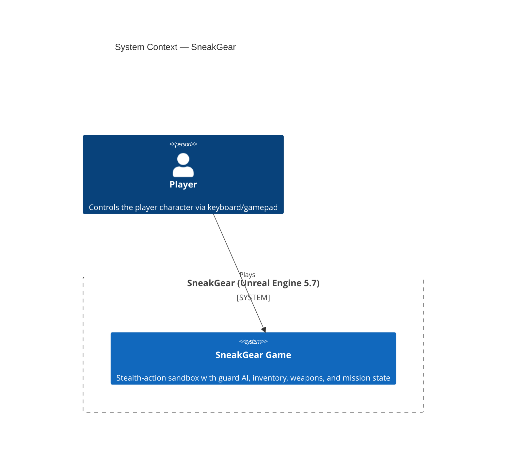
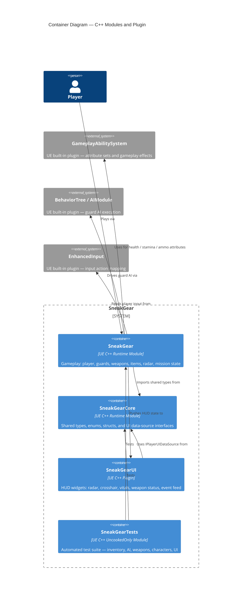
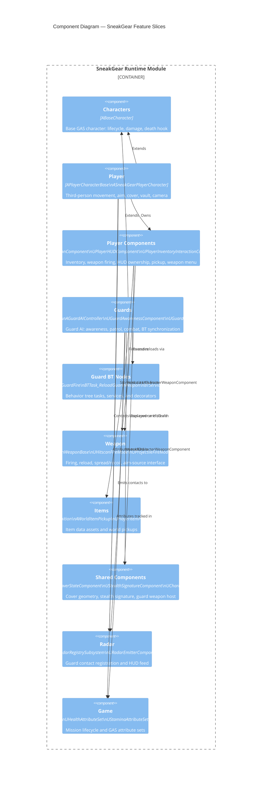
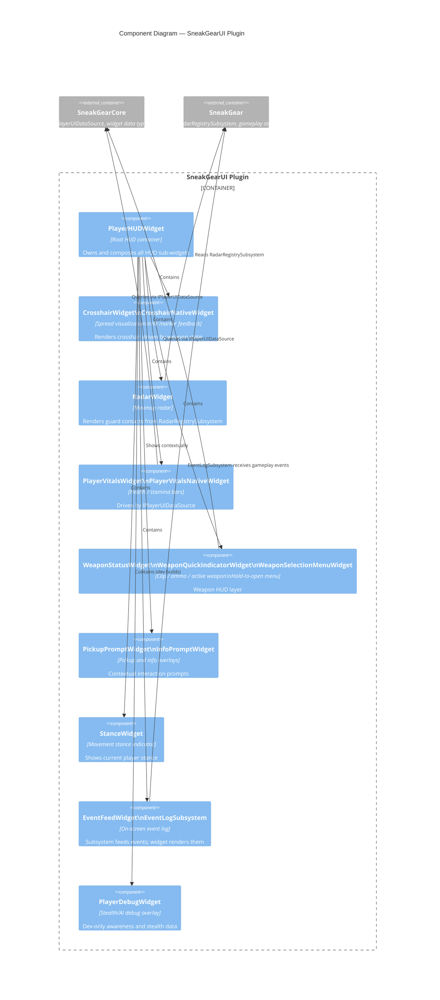

# C4 Architecture — SneakGear

C4 diagrams at the **Container** (module) and **Component** (feature slice) levels.

---

## Level 1 — System Context

---

## Level 2 — Containers (Modules)

---

## Level 3 — Components (Feature Slices within SneakGear)

---

## Level 3 — Components (SneakGearUI Plugin)

