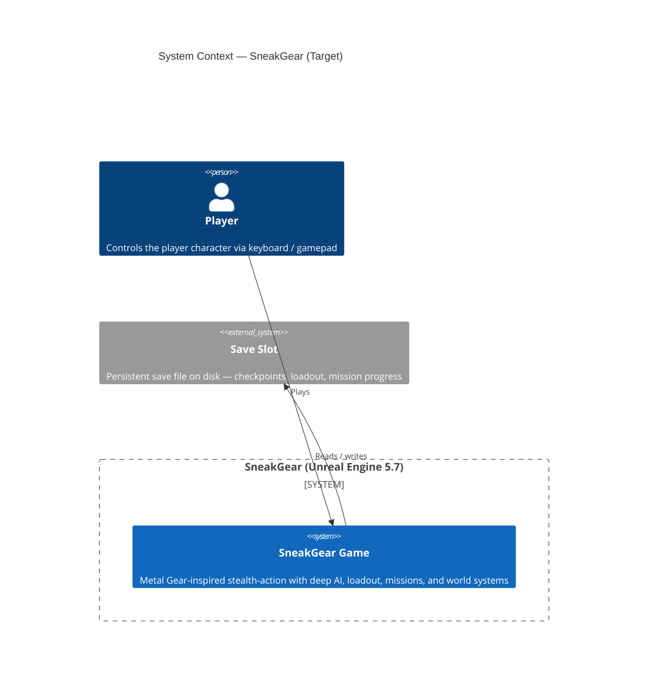
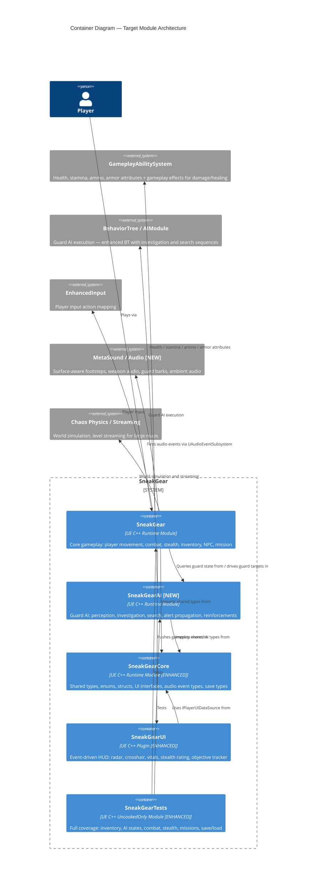
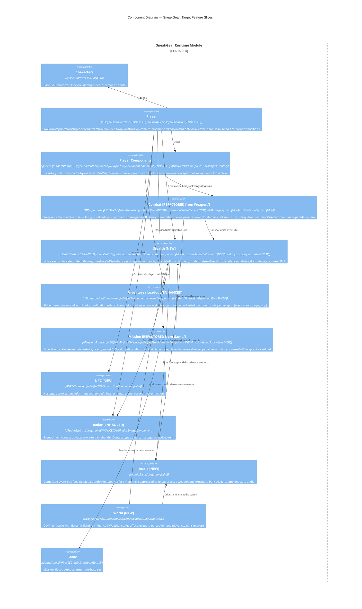
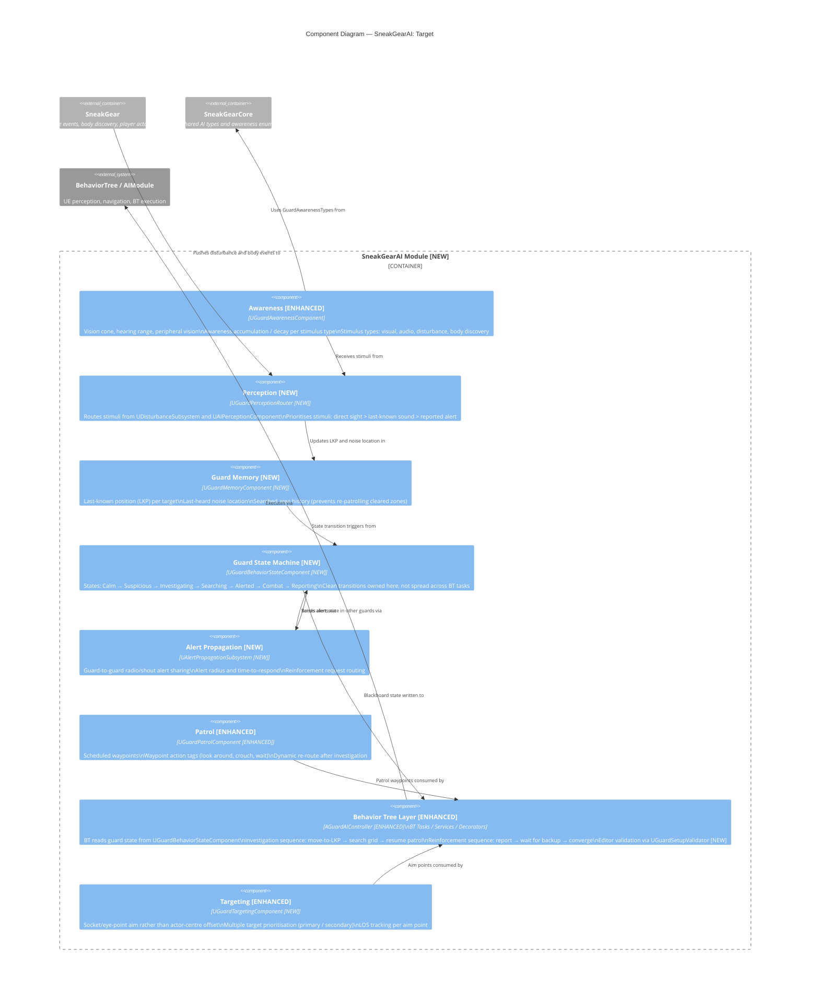
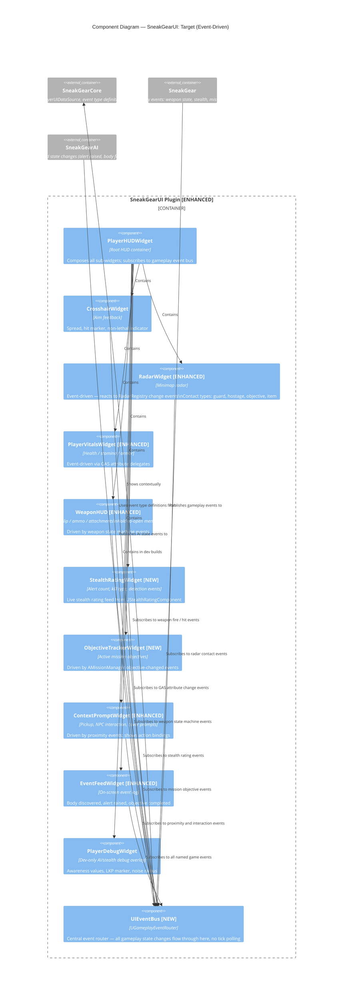

# C4 Architecture — SneakGear Target State

Diagrams showing the **intended architecture** derived from the goal checklist, technical debt backlog, and suggested next work. Annotations mark what is **new**, **enhanced**, or **refactored** vs the current state.

Legend:
- `[NEW]` — does not exist yet
- `[ENHANCED]` — exists but needs significant rework
- `[REFACTORED]` — exists but needs restructuring/renaming
- _(no annotation)_ — structurally sound, carries forward as-is

---

## Level 1 — System Context

---

## Level 2 — Containers (Target Module Split)

The main `SneakGear` module is split at the seams where responsibility has grown large enough to warrant isolation. New modules are annotated.

---

## Level 3 — Components: SneakGear (Target Feature Slices)

---

## Level 3 — Components: SneakGearAI (Target)

The AI grows into its own module to support investigation, search memory, alert propagation, and reinforcements — all currently absent.

---

## Level 3 — Components: SneakGearUI (Target)

---

## Summary of New Systems by Goal Checklist Item

| Goal | Target System |
|------|--------------|
| Walk / run / sprint / crouch / prone / vault / climb | `Player [ENHANCED]` — movement stance machine |
| Contextual cover: snap, lean, blind-fire, corner | `Player [ENHANCED]` — cover state component |
| Advanced camera | `Player [ENHANCED]` — shoulder swap, obstruction, cinematic |
| AI perception: hearing, peripheral, LKP | `SneakGearAI` — `UGuardPerceptionRouter`, `UGuardMemoryComponent` |
| AI behavior: investigate, search, reinforce | `SneakGearAI` — `UGuardBehaviorStateComponent`, `UAlertPropagationSubsystem` |
| Stealth feedback: awareness meter, body discovery | `Stealth [NEW]` — `UBodyDiscoverySubsystem`; `SneakGearUI` — stealth rating widget |
| Stealth tools: silencers, distractions, decoys, EMP | `Stealth [NEW]` — `UNoiseEmitterComponent`, tool item definitions |
| Non-lethal: chokeout, stun, tranq, restraints | `Combat [REFACTORED]` — `UNonLethalSystem` |
| Combat depth: damage falloff, armor, penetration | `Combat [REFACTORED]` — `UDamageSystem`, armor GAS attribute |
| Weapons: upgrades, attachments, ammo types | `Inventory / Loadout [ENHANCED]` — `UWeaponAttachmentComponent` |
| Inventory + loadout: weight, encumbrance | `Inventory / Loadout [ENHANCED]` — `UPlayerLoadoutComponent` |
| Missions: objectives, stealth ratings, penalties | `Mission [REFACTORED]` — `AMissionManager`, `UStealthRatingComponent` |
| NPC: hostage, escort, intel | `NPC [NEW]` — `ANPCCharacter`, `UNPCInteractionComponent` |
| World: day/night, weather | `World [NEW]` — `UDayNightCycleSubsystem`, `UWeatherSubsystem` |
| Audio: footsteps, barks, suppressed shots | `Audio [NEW]` — `UAudioEventSubsystem` + MetaSound |
| Save / load and checkpointing | `Mission [REFACTORED]` — `USaveLoadSubsystem` |
| UI: event-driven, interaction prompts | `SneakGearUI [ENHANCED]` — `UIEventBus`, context prompt widget |
| Optimization: AI, lighting, streaming | `Radar [ENHANCED]` event-driven; `World [NEW]` streaming; AI LOD budgets |
